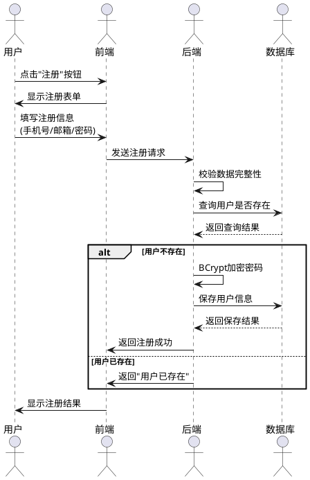
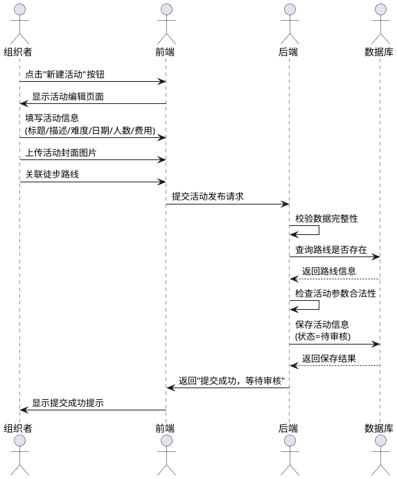
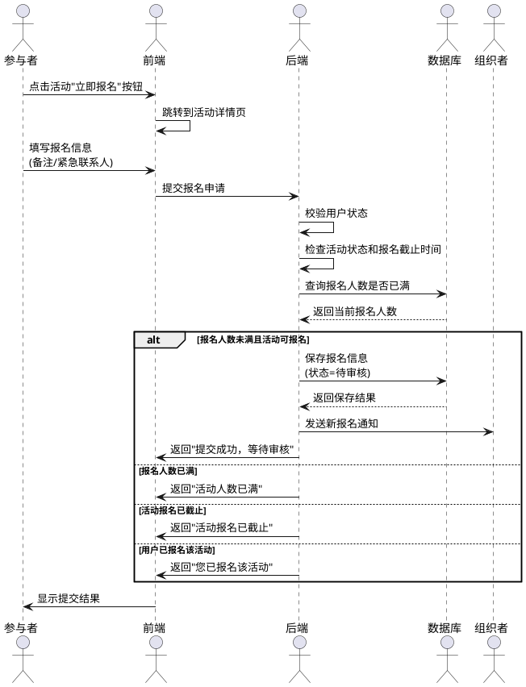
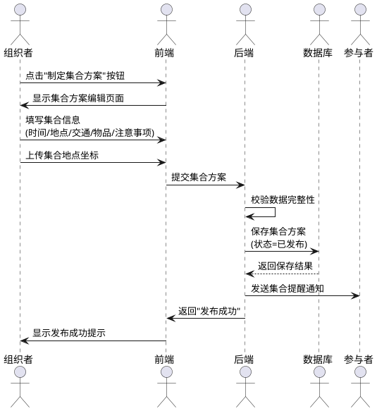
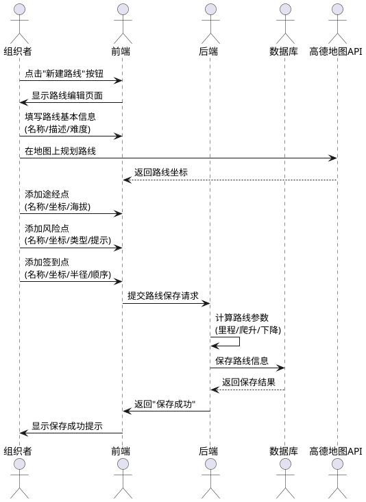
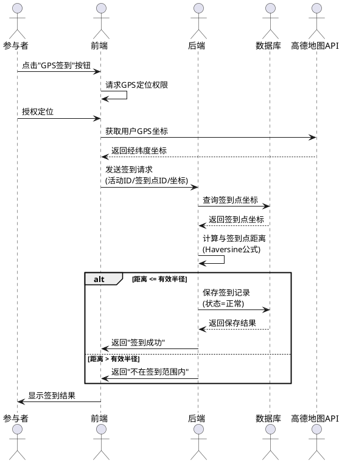
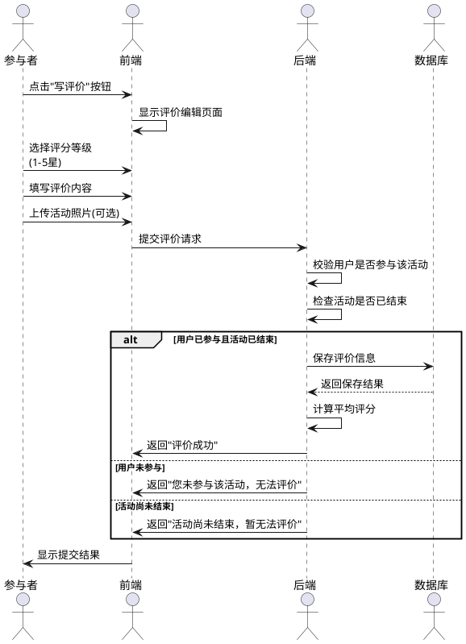
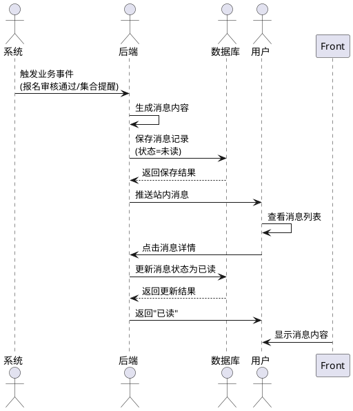

# 户外徒步活动管理系统 - 功能时序图

## 图4.3 用户注册时序图

---

## 图4.4 活动管理-发布徒步活动时序图

---

## 图4.5 报名管理-提交报名申请时序图

---

## 图4.6 集合管理-制定集合方案时序图

---

## 图4.7 路线管理-规划路线时序图

---

## 图4.8 签到管理-GPS签到时序图

---

## 图4.9 评价反馈-发送活动评价时序图

---

## 图4.10 消息通知-消息推送时序图

---

## 时序图使用说明

### PlantUML语法说明

1. **actor**：定义参与者角色
2. **->**：发送请求
3. **-->**：返回响应
4. **alt/else**：条件判断分支
5. **loop**：循环操作
6. **activate/deactivate**：激活/停用参与者的处理时间（可选）

### 图表编号对应关系

- 图4.3：4.2.2功能模块设计 - 用户管理
- 图4.4：4.2.2功能模块设计 - 活动管理
- 图4.5：4.2.2功能模块设计 - 报名管理
- 图4.6：4.2.2功能模块设计 - 集合管理
- 图4.7：4.2.2功能模块设计 - 路线管理
- 图4.8：4.2.2功能模块设计 - 签到管理
- 图4.9：4.2.2功能模块设计 - 评价反馈
- 图4.10：4.2.2功能模块设计 - 消息通知

### 在线PlantUML预览工具

可以使用以下在线工具查看和编辑时序图：
- PlantText：https://www.planttext.com/
- PlantUML Online Server：http://www.plantuml.com/plantuml/uml/

### 导出格式

PlantUML支持以下导出格式：
- PNG图片
- SVG矢量图
- PDF文档

建议在论文中使用PNG或SVG格式的图片，确保清晰度。

