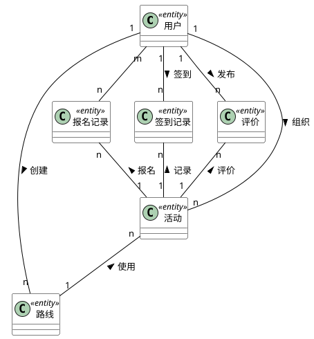
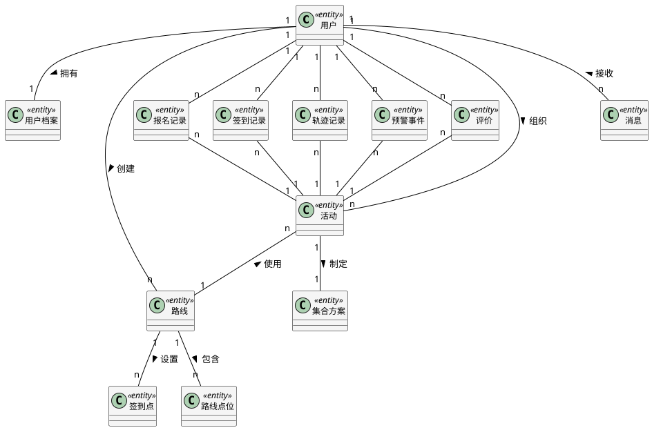

# 户外徒步活动管理系统E-R图（传统风格）

## PlantUML代码（简化版 - 推荐使用）

## PlantUML代码（详细版 - 含所有实体）

## 说明

### E-R图风格说明

本图采用**传统E-R图表示法**：
- **矩形框** - 表示实体（Entity）
- **菱形框** - 表示关系（Relationship）
- **1, n, m** - 表示基数约束（Cardinality）

### 核心实体（简化版 - 6个）

| 实体名称 | 说明 | 主要属性 |
|---------|------|---------|
| 用户 | 系统用户账号 | 用户名、密码、角色、状态 |
| 活动 | 徒步活动 | 标题、日期、难度、人数限制 |
| 路线 | 徒步路线 | 名称、距离、海拔、难度 |
| 报名记录 | 用户报名信息 | 状态、备注、审核信息 |
| 签到记录 | 用户签到数据 | 签到时间、位置、状态 |
| 评价 | 活动评价 | 评分、评论内容 |

### 核心实体（完整版 - 13个）

| 实体名称 | 说明 | 主要属性 |
|---------|------|---------|
| 用户 | 系统用户账号 | 用户名、密码、角色、状态 |
| 用户档案 | 用户详细信息 | 真实姓名、健康状况、紧急联系人 |
| 活动 | 徒步活动 | 标题、日期、难度、人数限制 |
| 路线 | 徒步路线 | 名称、距离、海拔、难度 |
| 报名记录 | 用户报名信息 | 状态、备注、审核信息 |
| 集合方案 | 活动集合安排 | 集合时间、地点、交通指引 |
| 签到点 | 路线签到点 | 名称、坐标、签到半径 |
| 路线点位 | 路线途经点 | 点位类型、坐标、风险提示 |
| 签到记录 | 用户签到数据 | 签到时间、位置、状态 |
| 轨迹记录 | GPS位置轨迹 | 坐标、海拔、速度 |
| 预警事件 | 异常预警 | 预警类型、级别、处理状态 |
| 评价 | 活动评价 | 评分、评论内容 |
| 消息 | 系统通知 | 标题、内容、消息类型 |

### 关系类型与基数

#### 简化版关系说明

**核心业务流程关系**：

1. **用户 → 活动（1:n）**
   - 说明：一个组织者可以创建多个活动
   - 关系：组织

2. **用户 → 路线（1:n）**
   - 说明：一个用户可以创建多条路线
   - 关系：创建

3. **活动 → 路线（n:1）**
   - 说明：多个活动可以使用同一条路线
   - 关系：使用

4. **用户 ↔ 活动（m:n，通过报名记录）**
   - 说明：用户可以报名多个活动，一个活动有多个报名
   - 关系：报名

5. **用户 ↔ 活动（m:n，通过签到记录）**
   - 说明：用户在活动中进行签到
   - 关系：签到

6. **用户 ↔ 活动（m:n，通过评价）**
   - 说明：用户可以评价参加过的活动
   - 关系：评价

---

#### 完整版关系说明

#### 1对1关系（1:1）
| 关系 | 说明 |
|------|------|
| 用户 - 拥有档案 - 用户档案 | 一个用户对应一份档案 |
| 活动 - 制定 - 集合方案 | 一个活动对应一个集合方案 |

#### 1对多关系（1:n）
| 关系 | 说明 |
|------|------|
| 用户 - 组织 - 活动 | 组织者可以创建多个活动 |
| 用户 - 创建 - 路线 | 用户可以创建多条路线 |
| 路线 - 使用 - 活动 | 一条路线可被多个活动使用 |
| 路线 - 设置签到点 - 签到点 | 一条路线包含多个签到点 |
| 路线 - 包含点位 - 路线点位 | 一条路线包含多个途经点位 |
| 用户 - 接收 - 消息 | 一个用户可以接收多条消息 |

#### 多对多关系（m:n）
| 关系 | 说明 | 中间实体 |
|------|------|---------|
| 用户 - 报名 - 活动 | 用户可报名多个活动，活动有多个报名 | 报名记录 |
| 用户 - 签到 - 签到点 - 活动 | 用户在多个活动的多个签到点打卡 | 签到记录 |
| 用户 - 上报轨迹 - 活动 | 用户在多个活动中上报GPS轨迹 | 轨迹记录 |
| 用户 - 触发预警 - 活动 | 用户在活动中可能触发多个预警 | 预警事件 |
| 用户 - 发布评价 - 活动 | 用户可评价多个活动 | 评价 |

### 业务流程关键点

1. **用户注册与档案管理**
   - 用户注册后自动创建用户档案
   - 用户档案包含健康状况、紧急联系人等信息

2. **活动发布流程**
   - 组织者创建或选择路线
   - 创建活动并关联路线
   - 制定集合方案

3. **报名与审核**
   - 用户提交报名申请
   - 组织者审核报名
   - 报名状态：待审核、已通过、已拒绝、候补中

4. **签到与监控**
   - 活动开始后，用户在签到点进行GPS签到
   - 系统记录用户实时位置轨迹
   - 异常情况触发预警事件

5. **评价反馈**
   - 活动结束后，用户可发布评价
   - 评价包含多维度评分和文字评论

### 数据完整性约束

1. **外键约束**：所有关系通过外键实现
2. **唯一性约束**：用户名、手机号、邮箱唯一
3. **非空约束**：核心字段不允许为空
4. **参照完整性**：删除父实体时，关联子实体的处理策略

### 与数据库表的对应关系

本E-R图对应15张数据库表（图中未显示字典类型和字典数据表）：
1. user（用户）
2. user_profile（用户档案）
3. activity（活动）
4. route（路线）
5. registration（报名记录）
6. gathering_plan（集合方案）
7. checkpoint（签到点）
8. route_point（路线点位）
9. check_in_record（签到记录）
10. track_record（轨迹记录）
11. alert_event（预警事件）
12. review（评价）
13. message（消息）
14. dict_type（字典类型）- 未在图中显示
15. dict_data（字典数据）- 未在图中显示

