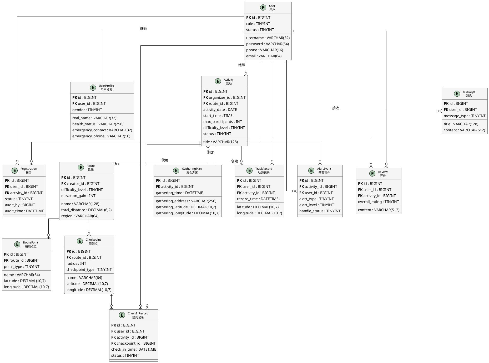

# 户外徒步活动管理系统E-R图（详细版）

## PlantUML代码

## 说明

### 图表优化说明

本版本对E-R图进行了**紧凑化处理**：
- 减少了实体中的冗余属性，只显示核心字段
- 优化了布局间距，使整体更紧凑
- 简化了关系标签，提高可读性
- 保持了完整的实体关系结构

### 核心实体（13个）

| 实体 | 说明 | 核心字段 |
|------|------|---------|
| User | 用户账号 | username, password, phone, role |
| UserProfile | 用户档案 | real_name, health_status, emergency_contact |
| Activity | 徒步活动 | title, activity_date, difficulty_level, status |
| Route | 徒步路线 | name, total_distance, elevation_gain |
| Registration | 报名记录 | user_id, activity_id, status |
| GatheringPlan | 集合方案 | gathering_time, gathering_address |
| Checkpoint | 签到点 | name, latitude, longitude, radius |
| RoutePoint | 路线点位 | point_type, name, latitude, longitude |
| CheckInRecord | 签到记录 | user_id, activity_id, checkpoint_id |
| TrackRecord | 轨迹记录 | user_id, activity_id, latitude, longitude |
| AlertEvent | 预警事件 | alert_type, alert_level, handle_status |
| Review | 活动评价 | user_id, activity_id, overall_rating |
| Message | 系统消息 | user_id, title, message_type |

### 主要关系

| 关系 | 类型 | 说明 |
|------|------|------|
| User ↔ UserProfile | 1:1 | 一个用户对应一份档案 |
| User → Activity | 1:N | 用户可组织多个活动 |
| User → Route | 1:N | 用户可创建多条路线 |
| User ↔ Activity | M:N | 通过Registration实现报名 |
| Activity ↔ GatheringPlan | 1:1 | 活动对应集合方案 |
| Activity → Route | N:1 | 多活动可用同一路线 |
| Route → RoutePoint | 1:N | 路线包含多个点位 |
| Route → Checkpoint | 1:N | 路线包含多个签到点 |
| User + Activity + Checkpoint | M:N:N | 通过CheckInRecord实现签到 |
| User + Activity | M:N | 通过TrackRecord记录轨迹 |
| User + Activity | M:N | 通过AlertEvent记录预警 |
| User + Activity | M:N | 通过Review实现评价 |
| User → Message | 1:N | 用户接收多条消息 |

### 特殊说明

1. **精简字段**：图中只显示核心字段，完整字段请参考数据库设计文档
2. **关联实体**：Registration、CheckInRecord等为中间表，实现多对多关系
3. **公共字段**：所有表都包含create_by, update_by, create_time, update_time（图中未显示）

