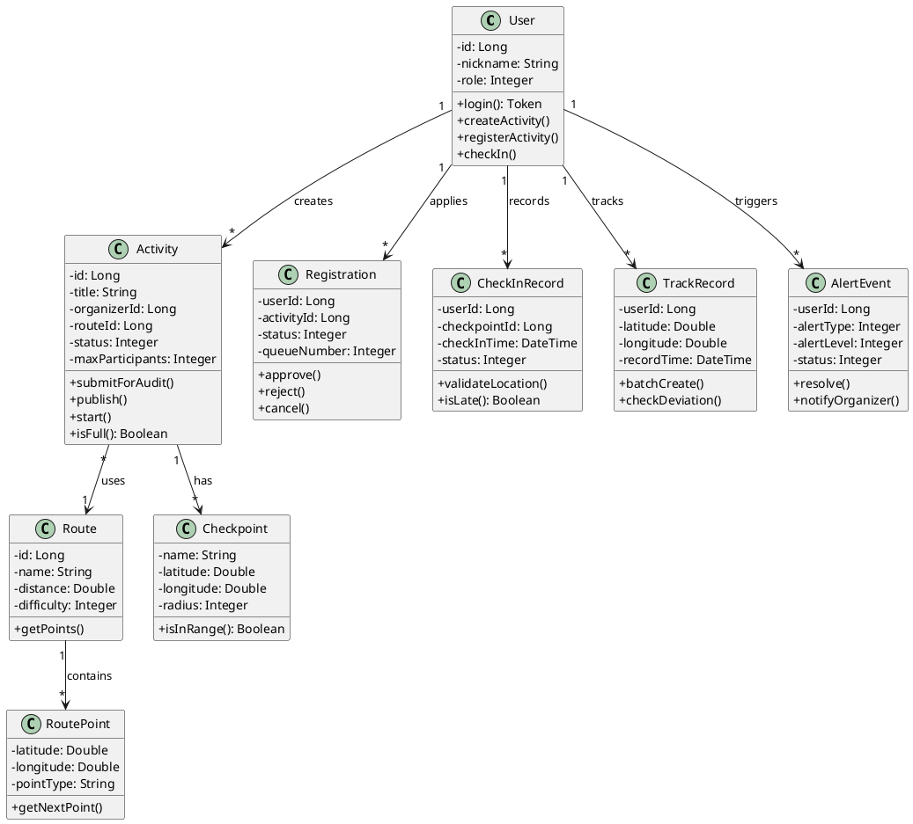

# 系统业务功能类图

## 类图概述

本系统采用面向对象的设计思想，将业务实体抽象为类。系统包含三个核心子系统：活动管理、报名管理、签到与轨迹。

## 方式一：类属性操作列表（方便复制）

### User（用户类）
```
属性：
- id: Long
- nickname: String
- role: Integer

操作：
+ login(): Token
+ createActivity()
+ registerActivity()
+ checkIn()
```

### Activity（活动类）
```
属性：
- id: Long
- title: String
- organizerId: Long
- routeId: Long
- status: Integer
- maxParticipants: Integer

操作：
+ submitForAudit()
+ publish()
+ start()
+ isFull(): Boolean
```

### Route（路线类）
```
属性：
- id: Long
- name: String
- distance: Double
- difficulty: Integer

操作：
+ getPoints()
```

### RoutePoint（路点类）
```
属性：
- latitude: Double
- longitude: Double
- pointType: String

操作：
+ getNextPoint()
```

### Checkpoint（检查点类）
```
属性：
- name: String
- latitude: Double
- longitude: Double
- radius: Integer

操作：
+ isInRange(): Boolean
```

### Registration（报名类）
```
属性：
- userId: Long
- activityId: Long
- status: Integer
- queueNumber: Integer

操作：
+ approve()
+ reject()
+ cancel()
```

### CheckInRecord（签到记录类）
```
属性：
- userId: Long
- checkpointId: Long
- checkInTime: DateTime
- status: Integer

操作：
+ validateLocation()
+ isLate(): Boolean
```

### TrackRecord（轨迹记录类）
```
属性：
- userId: Long
- latitude: Double
- longitude: Double
- recordTime: DateTime

操作：
+ batchCreate()
+ checkDeviation()
```

### AlertEvent（预警事件类）
```
属性：
- userId: Long
- alertType: Integer
- alertLevel: Integer
- status: Integer

操作：
+ resolve()
+ notifyOrganizer()
```

---

## 方式二：PlantUML 代码（可生成图片）

将以下代码复制到 https://www.plantuml.com/plantuml/uml 或 PlantUML 插件中即可生成类图：



---

## 类关系说明

| 关系 | 多重性 | 说明 |
|------|--------|------|
| User → Activity | 1 对 * | 一个组织者创建多个活动 |
| Activity → Route | * 对 1 | 多个活动使用同一条路线 |
| Route → RoutePoint | 1 对 * | 一条路线包含多个路点 |
| Activity → Checkpoint | 1 对 * | 一个活动有多个签到点 |
| User → Registration | 1 对 * | 一个用户多次报名 |
| User → CheckInRecord | 1 对 * | 一个用户多次签到 |
| User → TrackRecord | 1 对 * | 一个用户多条轨迹 |
| User → AlertEvent | 1 对 * | 一个用户多个预警 |
